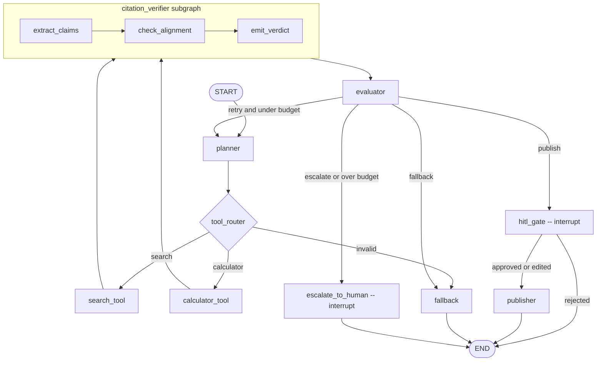

# Architecture: langgraph-week6-labs

## 1. System overview
This project is a single-repo LangGraph Research/QA agent that uses a typed hybrid state, a planner-selected tool path (search or calculator), a bounded citation-verifier subgraph, an evaluator-driven self-correction loop, and a dynamic human-approval gate before any publish side effects occur. It resolves the eight open questions from `domain-research.md §10` by choosing a hybrid `TypedDict` state plus chat history, treating publish as the only approval-required action, using one parent graph with one labeled subgraph, pinning a **file-backed `SqliteSaver` checkpointer** so the CLI and Streamlit panel can share state across processes, making CLI the canonical HITL surface with Streamlit parity, capping work at two total attempts, routing on evaluator/citation/tool-error evidence, and keeping observability local via JSONL instead of hosted tracing.



Diagram encapsulation rule: parent-graph edges connect to the `citation_verifier` subgraph as a single node (not to its internal `extract_claims`/`check_alignment`/`emit_verdict` nodes). The subgraph block visualizes the sub-agent's internal pipeline; the parent graph treats it as one labeled node per `parent.add_node("citation_verifier", compiled_subgraph)`.

## 2. Tech stack
`uv` is the required dependency manager/runtime wrapper (vision D-09 / GD-05); all install commands below assume `uv sync` followed by `uv run ...`.

| Component | Choice | Pin | Why |
|---|---|---|---|
| Python runtime | Python | `>=3.11` | Matches the vision baseline and keeps typing, `TypedDict`, and modern LangGraph support straightforward. Upper bound intentionally open — `uv` pins the exact interpreter via `.python-version` and will fetch it on `uv sync` if not present. Verified to work on 3.11/3.12/3.13/3.14. |
| Graph runtime | `langgraph` | `>=0.4,<0.5` | Core orchestration library for nodes, conditional edges, checkpoints, interrupts, and subgraphs. |
| OpenAI LangChain adapter | `langchain-openai` | `>=0.3,<0.4` | Required for `OpenAIChat` while staying aligned with current LangChain package split. |
| LangChain message types | `langchain-core` | `>=0.3,<0.4` | Imported directly for `AnyMessage`/message state typing used with `add_messages`. |
| OpenAI SDK | `openai` | `>=1,<2` | Underlying provider SDK; keeps provider-specific timeout/rate-limit exceptions available. |
| Web search | `tavily-python` | `>=0.5,<0.6` | Primary live search implementation behind the `Searcher` interface. |
| Validation models | `pydantic` | `>=2,<3` | Useful for validating provider payloads, resume payloads, and tool outputs without making full state validation mandatory. |
| Secondary UI | `streamlit` | `>=1,<2` | Lightweight review panel that reuses the same graph/checkpointer API as the CLI. |
| Test runner | `pytest` | `>=8,<9` | Covers graph wiring, routers, and the single offline end-to-end path required by GD-05. |
| Sqlite checkpointer | `langgraph-checkpoint-sqlite` | `>=2,<3` | Provides `SqliteSaver` so CLI and Streamlit processes share the same paused-graph state via one local DB file (required by GD-04 cross-process HITL). |
| Typing backports | `typing-extensions` | `>=4,<5` | Keeps `Literal`/future typing ergonomics stable across 3.11 patch lines and tooling. |
| Env loading | `python-dotenv` | `>=1,<2` | Loads `.env`/`.env.example` for API keys, model override, and offline toggle. |
| CLI rendering | `rich` | `>=13,<14` | Canonical CLI HITL surface uses formatted panels, tables, and approve/reject/edit prompts. |

Recommended scaffold commands:

```bash
uv add "langgraph>=0.4,<0.5" "langgraph-checkpoint-sqlite>=2,<3" "langchain-openai>=0.3,<0.4" "langchain-core>=0.3,<0.4" "openai>=1,<2" "tavily-python>=0.5,<0.6" "pydantic>=2,<3" "streamlit>=1,<2" "typing-extensions>=4,<5" "python-dotenv>=1,<2" "rich>=13,<14"
uv add --dev "pytest>=8,<9"
```

## 3. Repository layout
```text
langgraph-week6-labs/                                # single gradable repo for the Week 6 deliverable
├── pyproject.toml                                   # uv-managed project metadata, scripts, and dependency pins
├── uv.lock                                          # committed lockfile generated by `uv sync`
├── .env.example                                     # local config template for keys, model, and offline mode
├── .gitignore                                       # ignores virtualenvs, caches, local env files, and run artifacts
├── README.md                                        # setup, demo commands, and links to repo-local/project docs
├── cli.py                                           # canonical CLI entry point and HITL review surface
├── app.py                                           # Streamlit secondary UI for run inspection and approval
├── src/                                             # application source root
│   ├── agent/                                       # LangGraph orchestration package
│   │   ├── __init__.py                              # exports graph builders and public orchestration helpers
│   │   ├── state.py                                 # shared state schema, reducers, and initial-state factory
│   │   ├── graph.py                                 # graph assembly, checkpointer singleton, and compile logic
│   │   ├── routers.py                               # pure conditional-edge predicates and branch helpers
│   │   ├── logging.py                               # JSONL event writer and state-diff helpers
│   │   ├── nodes/                                   # one file per executable parent-graph node
│   │   │   ├── __init__.py                          # node export surface for graph construction
│   │   │   ├── planner.py                           # produces plan text and selects search vs calculator path
│   │   │   ├── search_tool.py                       # runs Searcher, normalizes sources, and drafts answer text
│   │   │   ├── calculator_tool.py                   # safely evaluates expressions and drafts answer text
│   │   │   ├── evaluator.py                         # scores answer quality and selects publish/retry/fallback/escalate
│   │   │   ├── hitl_gate.py                         # emits approval interrupt and stores human decision only
│   │   │   ├── publisher.py                         # calls publisher helpers after approval to create artifacts
│   │   │   ├── fallback.py                          # returns bounded fallback output after non-publishable failure
│   │   │   └── escalate_to_human.py                 # emits escalation interrupt after retry budget exhaustion
│   │   └── subgraphs/                               # nested workflows owned by the parent graph
│   │       ├── __init__.py                          # subgraph export surface
│   │       └── citation_verifier.py                 # extract_claims -> check_alignment -> emit_verdict subgraph
│   ├── tools/                                       # provider/tool abstractions selected by mode
│   │   ├── __init__.py                              # exports constructors for live/offline tool implementations
│   │   ├── searcher.py                              # `Searcher`, `TavilySearcher`, and `FakeSearcher`
│   │   ├── calculator.py                            # safe calculator helper and typed result model
│   │   └── llm.py                                   # `Chat`, `OpenAIChat`, and `StubChat` adapters
│   └── publisher/                                   # publish helpers separated from graph orchestration
│       ├── __init__.py                              # publisher package exports
│       └── publisher.py                             # atomic write/overwrite logic for markdown + eml outputs
├── tests/                                           # targeted pytest coverage required by GD-05
│   ├── conftest.py                                  # offline graph fixture and fake providers for deterministic tests
│   ├── test_graph_wiring.py                         # asserts nodes, edges, and compile-time graph shape
│   ├── test_routers.py                              # unit tests for planner/evaluator/HITL routing predicates
│   └── test_e2e_offline.py                          # one offline end-to-end path including retry and publish
├── logs/                                            # JSONL run evidence written per thread_id
│   └── .gitkeep                                     # keeps empty logs directory in git
├── outbox/                                          # publish artifacts keyed by thread_id
│   ├── answers/                                     # approved markdown answers
│   │   └── .gitkeep                                 # keeps answer outbox in git
│   └── sent/                                        # mock email envelopes
│       └── .gitkeep                                 # keeps sent outbox in git
├── .checkpoints/                                    # SqliteSaver-backed shared graph state (CLI + Streamlit)
│   └── .gitkeep                                     # keeps directory in git; agent.sqlite itself is gitignored
└── docs/                                            # repo-local documentation folder for graders/readers
    └── architecture.md                              # short repo summary that links back to this project architecture
```

## 4. State schema
The agent uses a hybrid typed state: task-specific fields drive routing and logging, while `messages` remains append-only via `add_messages` so the LLM transcript stays safe from list-overwrite bugs. `tool_calls`, `tool_results`, `evaluator_history`, and `retry_log` intentionally use reducers because they accumulate evidence across attempts. Retry entries are **structured** (`attempt`, `reason`, `mitigation`) so SM-03 can be satisfied by a single grep — not just a free-text reason list.

`src/agent/state.py`:

```python
from __future__ import annotations

from operator import add
from typing import Annotated, Literal, TypedDict

from langchain_core.messages import AnyMessage
from langgraph.graph.message import add_messages


# Closed enum of mitigation strategies recorded for each retry, satisfying vision §5
# "logged mitigation strategy" requirement and SM-03 "recorded reason, mitigation,
# and retry count".
Mitigation = Literal[
    "revised_query",         # planner rewrites the search query before the retry (weak citation)
    "switched_tool",         # planner selects the other tool (search<->calculator) on retry when tool_error blocks the chosen tool
    "added_context",         # planner adds prior tool results to the retry attempt's prompt (low confidence on calculator path)
    "escalated_to_human",    # terminal: budget exhausted with unsafe_to_publish == True
    "fell_back",             # terminal: budget exhausted with a safe bounded answer available
    "none",                  # first attempt or no mitigation applicable
]


class SourceRecord(TypedDict):
    title: str
    url: str
    snippet: str


class ToolCallRecord(TypedDict):
    tool: Literal["search", "calculator"]
    input: str
    attempt: int
    mode: Literal["live", "offline"]


class ToolResultRecord(TypedDict):
    tool: Literal["search", "calculator"]
    ok: bool
    summary: str
    error: str | None


class CitationVerdict(TypedDict):
    status: Literal["grounded", "weak", "not_applicable"]
    confidence: float
    notes: list[str]


class EvaluatorVerdict(TypedDict):
    status: Literal["pass", "retry", "fallback", "escalate"]
    score: float
    reason: str


class RetryLogEntry(TypedDict):
    attempt: int            # the attempt number that just FAILED (i.e., the one being retried away from)
    reason: str             # human-readable explanation, e.g. "citation_verdict weak (confidence 0.42)"
    mitigation: Mitigation  # closed-enum strategy applied for the next attempt or terminal route


class AgentState(TypedDict):
    thread_id: str
    question: str
    plan: str
    selected_tool: Literal["search", "calculator"] | None
    draft_answer: str
    edited_text: str | None
    sources: list[SourceRecord]
    messages: Annotated[list[AnyMessage], add_messages]
    tool_calls: Annotated[list[ToolCallRecord], add]
    tool_results: Annotated[list[ToolResultRecord], add]
    evaluator_verdict: EvaluatorVerdict | None
    evaluator_history: Annotated[list[EvaluatorVerdict], add]
    citation_verdict: CitationVerdict | None
    attempt: int
    max_attempts: int
    retry_log: Annotated[list[RetryLogEntry], add]   # structured: {attempt, reason, mitigation}
    confidence: float
    decision: Literal["search", "calculate", "publish", "retry", "fallback", "escalate", "end"]
    human_decision: Literal["pending", "approved", "rejected", "edited", "acknowledged"]
    unsafe_to_publish: bool       # set by evaluator from citation_verdict + tool_error; consumed by route_after_evaluator
    published_path: str | None
    mode: Literal["live", "offline"]
    tool_error: str | None


def initial_state(question: str, thread_id: str, mode: Literal["live", "offline"]) -> AgentState:
    return {
        "thread_id": thread_id,
        "question": question,
        "plan": "",
        "selected_tool": None,
        "draft_answer": "",
        "edited_text": None,
        "sources": [],
        "messages": [],
        "tool_calls": [],
        "tool_results": [],
        "evaluator_verdict": None,
        "evaluator_history": [],
        "citation_verdict": None,
        "attempt": 0,
        "max_attempts": 2,
        "retry_log": [],
        "confidence": 0.0,
        "decision": "end",
        "human_decision": "pending",
        "unsafe_to_publish": False,
        "published_path": None,
        "mode": mode,
        "tool_error": None,
    }
```

Notes:
- `attempt` starts at `0`; `planner` increments it at the start of each execution cycle, making `max_attempts=2` mean exactly one initial pass plus one retry.
- `sources` is intentionally overwritten with the latest attempt's authoritative evidence, while historical attempts stay preserved in `tool_results`, `evaluator_history`, and `retry_log`.
- `mode` is first-class state so every node and every JSONL line can emit `live` or `offline` consistently.
- `retry_log` entries are structured `{attempt, reason, mitigation}` — `mitigation` is a closed `Literal` enum so logs and evaluator decisions cannot drift to ad-hoc strings. The evaluator is the **only** writer of `retry_log` entries (one entry per retry decision); other nodes never append.
- `unsafe_to_publish` is a derived boolean **set by the evaluator** from `citation_verdict.status`, `tool_error`, and `confidence`; routers read it but do not write it, so the rule has one owner. Computed as: `unsafe_to_publish = (citation_verdict.status == "weak" and citation_verdict.confidence < 0.70) or bool(tool_error) or confidence < 0.50`.
- `human_decision` includes `"acknowledged"` for the escalation interrupt: a human reviewer who takes over the case acknowledges (and may optionally edit), terminating the run without invoking `publisher`.
- Feature 008 adds `research_report`, `research_depth`, and `research_plan` to the shared state so the search path can switch between legacy single-query behavior and deep multi-query synthesis without changing downstream node contracts. `citation_verifier` also uses an internal `_verifier_claim_citations` buffer to carry per-fact cited-source indices between its subgraph steps.

## 5. Node specifications
### planner
- **Purpose:** Produce a concise plan, choose the next tool path, and increment the attempt counter before any expensive work happens.
- **Inputs:** `question`, `attempt`, `max_attempts`, `retry_log`, `messages`, `mode`.
- **Outputs:** `attempt`, `plan`, `selected_tool`, `decision`, `messages`, `tool_error` (reset to `None` on success).
- **Error behavior:** If the live LLM times out or rate-limits, retry once inside the node; if the output cannot be parsed into a valid tool choice, treat that as a logic/validation failure and route to `fallback` rather than retrying indefinitely.
- **Retry policy:** `RetryPolicy(max_attempts=2)` in live mode, preserving LangGraph defaults so only transient provider errors (timeout, connection, rate-limit/server faults) retry; validation and programmer errors do not.
- **Idempotency:** Pure computation only; rerunning simply overwrites `plan`/`selected_tool` and appends new messages.

### tool_router
- **Purpose:** Pure routing function, not a graph node; decide whether the planner selected `search_tool` or `calculator_tool`.
- **Inputs:** `selected_tool`, `decision`, `question`.
- **Outputs:** No state writes; returns the next node name.
- **Error behavior:** If `selected_tool` is missing or invalid, return `fallback` rather than throwing.
- **Retry policy:** None; it is deterministic pure logic.
- **Idempotency:** Fully idempotent and side-effect free.

### search_tool
- **Purpose:** Execute the `Searcher` interface (`TavilySearcher` live, `FakeSearcher` offline), normalize source records, and draft an answer using the `Chat` adapter (`OpenAIChat` live, `StubChat` offline).
- **Inputs:** `question`, `plan`, `attempt`, `mode`.
- **Outputs:** `tool_calls` (append), `tool_results` (append), `sources`, `draft_answer`, `confidence`, `messages`, `tool_error`.
- **Error behavior:** Structured provider failures become `tool_error`/`tool_results` entries so the evaluator can decide retry vs fallback; invalid response shape is treated as non-retryable validation failure.
- **Retry policy:** `RetryPolicy(max_attempts=2)` in live mode, again preserving default transient-exception filtering for provider/network failures only.
- **Idempotency:** No external side effects; duplicate execution only rewrites the latest `sources`/`draft_answer` and appends another structured result record.

### search_tool — deep-research mode (added in feature 008)
- On the search path, `planner` now chooses `research_depth` (`shallow` or `deep`) and populates `research_plan` before `search_tool` runs.
- `search_tool` always calls `Searcher.multi_search(research_plan, max_per_query=3)`, dedupes results by URL, and stores the union back into `sources`.
- `shallow` keeps the legacy one-query answer contract, but still materializes a minimal `ResearchReport` so downstream nodes can read a uniform structure.
- `deep` fans out into 3–5 sub-queries, synthesizes a structured `ResearchReport` (`direct_answer`, `key_facts`, `perspectives`, `unknowns`, `glossary`, `sources_by_domain`, `sub_queries_run`), and mirrors `direct_answer` into `draft_answer` so `citation_verifier`, `evaluator`, `hitl_gate`, and `publisher` remain graph-compatible.
- In live mode the decomposition/report synthesis steps ask the LLM for JSON; in offline mode the same flow stays deterministic by deriving sub-queries from the original question text and stubbing fact extraction from the retrieved snippets.

### calculator_tool
- **Purpose:** Safely evaluate arithmetic questions and turn the result into a short draft answer without needing web citations.
- **Inputs:** `question`, `plan`, `attempt`, `mode`.
- **Outputs:** `tool_calls` (append), `tool_results` (append), `draft_answer`, `sources` (usually empty), `confidence`, `tool_error`.
- **Error behavior:** Parse errors, divide-by-zero, and unsupported expressions are captured as structured tool errors and are not retried because they are deterministic logic/input failures.
- **Retry policy:** No `RetryPolicy`; retries would only mask logic problems or bad user input.
- **Idempotency:** Pure local computation only.

### evaluator
- **Purpose:** Score whether the current draft is publishable, retry-worthy, fallback-worthy, or escalation-worthy after considering both tool output quality and citation-verifier output. Single owner of `retry_log` and `unsafe_to_publish`.
- **Inputs:** `draft_answer`, `sources`, `tool_results`, `tool_error`, `citation_verdict`, `attempt`, `max_attempts`, `retry_log`, `confidence`, `mode`.
- **Outputs:** `evaluator_verdict`, `evaluator_history` (append), `decision`, `confidence`, `unsafe_to_publish`, `retry_log` (append exactly one structured entry `{attempt, reason, mitigation}` whenever the chosen branch is `retry`, `fallback`, or `escalate_to_human`; never appends on `pass`).
- **Mitigation selection rule:** when emitting a retry/fallback/escalate entry, the evaluator picks `mitigation` deterministically. The rule respects the `max_attempts=2` budget — there is at most one retry, so non-terminal mitigations only apply when `attempt < max_attempts` and terminal mitigations only apply when `attempt >= max_attempts`:
  - **Non-terminal (chosen only when `attempt < max_attempts` and the decision is `retry`):**
    - `weak citation_verdict (status="weak" or confidence < 0.70)` → `revised_query`
    - `tool_error present on chosen tool` → `switched_tool`
    - `low confidence on calculator path (confidence < 0.75 and status == "not_applicable")` → `added_context`
  - **Terminal (chosen when `attempt >= max_attempts` OR the decision is `fallback`/`escalate`):**
    - `unsafe_to_publish == True` → `escalated_to_human` (and the next branch is `escalate_to_human`)
    - `unsafe_to_publish == False` → `fell_back` (and the next branch is `fallback`)
  - Every value of the `Mitigation` enum except `"none"` is reachable from this rule under the documented retry budget.
- **Error behavior:** Empty/invalid evaluator output is treated as a logic failure, sets `unsafe_to_publish=True`, and routes to `fallback`; weak evidence, weak citations, or structured tool errors are represented in state rather than as crashes.
- **Retry policy:** `RetryPolicy(max_attempts=2)` in live mode for transient provider faults only; schema/validation/programmer errors remain non-retryable.
- **Idempotency:** Pure scoring/routing logic; safe to rerun.

### citation_verifier
- **Purpose:** Parent-graph node implemented as a 3-node subgraph that extracts factual claims from `draft_answer`, checks each claim against `sources`, and emits a grounding verdict consumed by `evaluator`.
- **Inputs:** `draft_answer`, `sources`, `mode`, `attempt`.
- **Outputs:** `citation_verdict`, `confidence` (may be lowered), optional verifier notes embedded in the verdict.
- **Error behavior:** If there are no sources (calculator path), emit `status="not_applicable"` with high confidence instead of failing. If live verification tooling times out, retry once; if parsing/validation fails, emit `status="weak"` so the evaluator can decide whether to retry or escalate.
- **Retry policy:** Inner `extract_claims` and `check_alignment` steps use `RetryPolicy(max_attempts=2)` with default transient filtering; `emit_verdict` is deterministic and does not retry.
- **Idempotency:** Pure read/compare work; safe to rerun because it performs no side effects.
- **Subgraph state:** the subgraph **shares the parent state shape** (it reads `draft_answer`/`sources`/`mode`/`attempt` and writes `citation_verdict`/`confidence`), so the compiled subgraph is added to the parent via `parent.add_node("citation_verifier", subgraph)` per domain-research §LG-Subgraphs — no transformation wrapper needed.

The three internal nodes:

#### citation_verifier.extract_claims
- **Purpose:** Parse `draft_answer` into a list of atomic factual claims (each ≤ 1 sentence) suitable for source-by-source checking.
- **Inputs (subgraph state):** `draft_answer`, `mode`.
- **Outputs (subgraph state):** internal `_claims: list[str]` (subgraph-local; not surfaced to parent state).
- **Error behavior:** If the LLM returns no claims (very short or non-factual draft), output an empty list and let `check_alignment` short-circuit to `not_applicable`.
- **Retry policy:** `RetryPolicy(max_attempts=2)` in live mode for transient provider faults; offline mode uses a deterministic regex-based splitter that does not retry.
- **Idempotency:** Pure parsing.

#### citation_verifier.check_alignment
- **Purpose:** For each claim from `extract_claims`, score whether the union of `sources[*].snippet` supports it. Score is `0.0–1.0` per claim.
- **Inputs (subgraph state):** `_claims`, `sources`, `mode`.
- **Outputs (subgraph state):** internal `_per_claim_scores: list[float]`, `_per_claim_notes: list[str]`.
- **Error behavior:** Per-claim scoring failures degrade gracefully — a failed claim contributes score `0.0` and a note `"unable to verify"` rather than failing the whole verifier.
- **Retry policy:** `RetryPolicy(max_attempts=2)` in live mode; offline mode uses substring/heuristic matching with no retry.
- **Idempotency:** Pure computation.

#### citation_verifier.emit_verdict
- **Purpose:** Aggregate per-claim scores into a final `CitationVerdict` and write it back into parent state (which the subgraph shares).
- **Inputs (subgraph state):** `_claims`, `_per_claim_scores`, `_per_claim_notes`, `sources`.
- **Outputs (parent state):** `citation_verdict` (`status`, `confidence`, `notes`), `confidence` (parent-state mirror, set to the verdict's confidence so the evaluator and routers can read it directly).
- **Aggregation rule:** `confidence = mean(_per_claim_scores)`; `status = "grounded" if confidence >= 0.70 else "weak"`; if `len(sources) == 0`, override to `status="not_applicable"` with `confidence=1.0`.
- **Error behavior:** Deterministic; cannot fail except on programmer error (which is non-retryable).
- **Retry policy:** None.
- **Idempotency:** Pure computation; safe to rerun.

### hitl_gate
- **Purpose:** Emit the canonical approval interrupt after evaluator success and before any publish side effects.
- **Inputs:** `draft_answer`, `sources`, `citation_verdict`, `attempt`, `mode`, `thread_id`.
- **Outputs:** `human_decision`, `edited_text`, `decision` (set to `publish` or `end` after resume).
- **Error behavior:** The node must not catch the interrupt signal with a broad `try/except`. Invalid resume payloads are rejected by schema validation and surfaced back to the caller for re-entry.
- **Retry policy:** None; `interrupt()` is control flow, not a retryable error.
- **Idempotency:** Critical: nothing before `interrupt()` may perform side effects because the node restarts from the top on resume. This node only packages JSON-serializable review data and stores the resume decision.

### publisher
- **Purpose:** After human approval, atomically publish the final artifacts by thread ID: `outbox/answers/<thread_id>.md`, `outbox/sent/<thread_id>.eml`, and the SMTP-style envelope echoed to stdout.
- **Inputs:** `thread_id`, `draft_answer`, `edited_text`, `human_decision`, `sources`, `mode`, `published_path`.
- **Outputs:** `published_path`, `decision` (set to `end`).
- **Entry guard (dedupe rule):** the very first instruction in the node is `if state["published_path"] is not None: return {}` — i.e., publisher becomes a no-op on any subsequent re-execution. Because `published_path` is only ever set as the final write of a successful first execution, this single guard prevents duplicate file writes, duplicate email envelopes, and duplicate stdout echoes regardless of how the node is re-entered (resume, replay, or operator restart).
- **Side-effect ordering:** on first execution the node performs (1) compose markdown body in memory, (2) compose `.eml` envelope in memory, (3) write `.md` to a sibling temp file then `os.replace` onto `outbox/answers/<thread_id>.md`, (4) write `.eml` to a sibling temp file then `os.replace` onto `outbox/sent/<thread_id>.eml`, (5) print the SMTP envelope to stdout, (6) set `published_path` and emit the `publish` JSONL line. Steps 3–4 are atomic per file via `os.replace`; if either fails before step 6, `published_path` stays `None`, so the next run re-attempts the entire block (idempotent by overwrite).
- **Error behavior:** If local file I/O fails, log the partial failure and retry safely because the final targets are overwrite-by-thread-id and `published_path` is only set after both writes succeed.
- **Retry policy:** `RetryPolicy(max_attempts=2, retry_on=(OSError,))`.
- **Idempotency:** Strongly idempotent by design via the entry guard plus overwrite-by-thread_id. Re-execution after `published_path` is set produces zero side effects.

### fallback
- **Purpose:** Return a bounded, non-publishing fallback response when the graph cannot safely continue but does not require manual takeover.
- **Inputs:** `question`, `tool_results`, `retry_log`, `attempt`, `mode`.
- **Outputs:** `draft_answer`, `confidence`, `decision` (set to `end`), `messages`.
- **Error behavior:** No retries; it should be deterministic and always produce a safe explanatory answer.
- **Retry policy:** None.
- **Idempotency:** Pure text generation/local formatting only.

### escalate_to_human
- **Purpose:** Emit a second, distinct interrupt for retry-budget-exhausted or ambiguous cases that should stop auto-execution and hand off to a human reviewer.
- **Inputs:** `question`, `draft_answer`, `sources`, `retry_log`, `attempt`, `mode`, `thread_id`.
- **Outputs:** `human_decision` (set to `"acknowledged"` or `"edited"` based on the resume payload), `edited_text` (when applicable), `decision` (set to `end`).
- **Error behavior:** Same interrupt rule as `hitl_gate`: do not swallow the control-flow exception and keep the payload JSON-serializable.
- **Retry policy:** None.
- **Idempotency:** Also side-effect free before the interrupt. To avoid ordering bugs, this node has exactly one `interrupt()` call and no nested interrupt sequence. The terminal `acknowledged` write into `human_decision` is the only state change after resume.

Global node rule: the MVP stays synchronous end-to-end. That intentionally avoids the async/event-loop pitfall from domain research §7 while remaining easy to run from both CLI and Streamlit.

## 6. Routing and conditional edges
| Predicate function | Source node | Possible destinations | Decision rule (pseudocode) | State inspected |
|---|---|---|---|---|
| `route_planner_output` | `planner` | `search_tool` \| `calculator_tool` \| `fallback` | `if selected_tool == "search": return "search_tool"; elif selected_tool == "calculator": return "calculator_tool"; else: return "fallback"` | `selected_tool`, `decision`, `question` |
| `route_after_evaluator` | `evaluator` | `hitl_gate` (publish branch) \| `planner` (retry loop-back) \| `fallback` \| `escalate_to_human` | `if verdict.status == "pass" and not unsafe_to_publish: return "hitl_gate"; if verdict.status == "retry" and attempt < max_attempts: return "planner"; if (verdict.status == "escalate" or attempt >= max_attempts) and unsafe_to_publish: return "escalate_to_human"; return "fallback"` | `evaluator_verdict`, `unsafe_to_publish`, `attempt`, `max_attempts` |
| `route_after_hitl` | `hitl_gate` | `publisher` \| `END` | `if human_decision in {"approved", "edited"}: return "publisher"; return END` | `human_decision`, `edited_text` |

Fixed edges that are part of the source-of-truth graph shape:
- `search_tool -> citation_verifier` and `calculator_tool -> citation_verifier` always run so the evaluator always receives a citation verdict shape.
- `citation_verifier -> evaluator` is unconditional; the evaluator consumes either `grounded`, `weak`, or `not_applicable`.
- `fallback -> END`, `publisher -> END`, and `escalate_to_human -> END` are terminal edges.

The evaluator row above is the implementation of the required conceptual branch `{publish | retry-loop-back | fallback | escalate_to_human}`; the publish branch is mediated by `hitl_gate` because vision §12 requires approval before `publisher` executes.

## 7. Self-correction loop
Lab 6.3 is implemented as a single bounded retry loop with **`max_attempts=2` total attempts**: one initial pass and at most one retry.

1. **Attempt counter:** `initial_state()` starts `attempt=0`; `planner` increments it to `1` on first entry and to `2` if the evaluator routes back for one retry.
2. **Retry-eligible failures:**
   - evaluator score below the publish threshold (target: `< 0.75`),
   - citation verifier returns `status="weak"` or `confidence < 0.70`,
   - structured tool failure from `search_tool`/`calculator_tool` that represents a transient provider issue or incomplete evidence.
3. **Non-retry-eligible failures:**
   - programmer errors (`TypeError`, `AssertionError`, bad imports, coding bugs),
   - schema/validation failures on planner/evaluator outputs,
   - deterministic calculator parse failures or unsafe expressions,
   - malformed interrupt resume payloads.
4. **Stop condition formula:** `should_retry = retry_eligible and attempt < max_attempts`; otherwise the graph must choose `fallback` or `escalate_to_human` and can never loop again. The check is evaluated **before** the next attempt is launched (decide-then-act), not after.
5. **Fallback vs escalation rule:**
   - `fallback` when the system can still return a safe bounded answer/explanation without pretending certainty (`unsafe_to_publish == False`).
   - `escalate_to_human` when retries are exhausted and `unsafe_to_publish == True` (contradictory citations, unresolved tool failure, or too little evidence to publish safely).
6. **Mitigation enum (the closed strategy set logged with each retry/fallback/escalate decision):**
   - **Non-terminal** (apply on a retry, only valid when `attempt < max_attempts`):
     - `revised_query` — planner rewrites the search query (default for weak citation on first attempt).
     - `switched_tool` — planner selects the other tool (search↔calculator) when a `tool_error` blocked the originally chosen tool.
     - `added_context` — planner adds prior tool results to the retry attempt's prompt (default for low confidence on the calculator path).
   - **Terminal** (no further retry, applied when `attempt >= max_attempts` or the decision is `fallback`/`escalate`):
     - `escalated_to_human` — `unsafe_to_publish == True` and budget exhausted; branch is `escalate_to_human`.
     - `fell_back` — `unsafe_to_publish == False` and budget exhausted; branch is `fallback`.
   - `none` — first attempt or no mitigation applicable (used by the planner-side initial log entry, if any).
   - Under `max_attempts=2`, the evaluator selects exactly one mitigation per decision; the rule in §5 evaluator covers every reachable case.
7. **Logging rule:** every retry/fallback/escalate decision appends exactly **one** structured `RetryLogEntry` `{attempt, reason, mitigation}` to `retry_log` (the evaluator is the sole writer) and writes a `retry` JSONL line that includes the same `attempt`, `reason`, `mitigation`, and the next branch. Free-text reasons are allowed; mitigations are restricted to the enum above so SM-03 can be verified by a single grep.
8. **Offline testability:** the stubbed offline path intentionally makes attempt 1 weak and attempt 2 strong so `tests/test_e2e_offline.py` can prove the retry loop deterministically.

This keeps the correction behavior explicit, observable, and aligned with the Week 6 lab expectation that retries be bounded, justified, and auditable.

## 8. Human-in-the-loop design
The approval gate is a **dynamic `interrupt()`** inside `hitl_gate`, not a static `interrupt_before`, because the project needs a real review payload and a real resume value rather than a debug breakpoint.

**Interrupt payload shape (JSON-serializable):**

```json
{
  "kind": "approval",
  "draft_answer": "string",
  "sources": [{"title": "...", "url": "...", "snippet": "..."}],
  "verifier_verdict": {"status": "grounded|weak|not_applicable", "confidence": 0.0, "notes": []},
  "attempt": 1,
  "mode": "live|offline"
}
```

**Resume value shape:**

```json
{
  "decision": "approved|rejected|edited|acknowledged",
  "edited_text": "optional string when decision == edited"
}
```

The `acknowledged` value is reserved for the `escalate_to_human` interrupt (`kind: "escalation"`); the approval gate accepts only `approved | rejected | edited`.

Design rules:
- **Placement:** after evaluator pass, before publisher. `hitl_gate` never writes files, sends email, or emits stdout side effects.
- **Restart semantics:** on resume, LangGraph restarts the node from the top, so `hitl_gate` must only re-create the same payload and then store the returned decision. All irreversible work lives in `publisher`, which has its own entry guard against duplicate execution.
- **CLI surface (canonical):** `cli.py` uses `rich` to print the draft answer, source list, verifier verdict, and options `[a]pprove / [r]eject / [e]dit`; it converts the selection into `Command(resume=...)` for the same `thread_id` against the **shared `SqliteSaver`** at `.checkpoints/agent.sqlite`.
- **Streamlit surface (secondary):** `app.py` opens a `SqliteSaver` against the **same** `.checkpoints/agent.sqlite` file (read-write, WAL mode), reads the paused state by `thread_id`, displays the same payload fields, and posts the same resume payload via `Command(resume=...)`. Because both processes share the file, a CLI-launched run can be approved/rejected from the Streamlit UI and vice versa.
- **Evidence parity:** both surfaces must log `interrupt_emitted` and `interrupt_resumed` with the same event schema so the grader can grep logs rather than depend on UI screenshots.
- **Escalation interrupt:** `escalate_to_human` uses the same mechanics with `kind: "escalation"`, payload includes `retry_log`, and the resume payload uses `decision: "acknowledged"` (or `"edited"`); it ends the graph after human takeover instead of calling `publisher`.

This directly maps to Lab 6.4: explicit human approval before a high-impact publish action, stable resume mechanics, and observable evidence that approval happened before side effects.

## 9. Observability and logging
Each run writes `logs/run-<thread_id>.jsonl`. Every line includes `{ts, thread_id, attempt, node, event, mode, ...}` and logs **state diffs**, not full state snapshots. This keeps the evidence grep-able and small while still proving routing, retries, interrupts, and publish behavior.

**File handling:** the JSONL writer opens the file in **append mode** (`"a"`). On resume after an interrupt — even from a different process (CLI ↔ Streamlit, both sharing `.checkpoints/agent.sqlite`) — the same `logs/run-<thread_id>.jsonl` is reopened and continued. Pre-interrupt evidence is **never** truncated. Each writer call also `flush()`es so partial runs leave durable evidence on crash.

**Event schema:**
- Required keys: `ts`, `thread_id`, `attempt`, `node`, `event`, `mode`.
- Common optional keys: `state_diff`, `branch`, `tool`, `latency_ms`, `error`, `score`, `answer_path`, `eml_path`, `decision`, `reason`, `mitigation`.
- Allowed `event` values: `node_enter`, `node_exit`, `branch_decision`, `tool_call`, `tool_result`, `tool_error`, `retry`, `interrupt_emitted`, `interrupt_resumed`, `publish`, `escalate`, `end`.
- `retry` and `escalate` events MUST include `reason` (free-text) and `mitigation` (closed enum from §7 step 6).

**Sample JSONL lines:**

```json
{"ts":"2026-05-15T12:00:00Z","thread_id":"t-001","attempt":1,"node":"planner","event":"node_enter","mode":"offline","state_diff":{"question":"What is 12*12?"}}
{"ts":"2026-05-15T12:00:00Z","thread_id":"t-001","attempt":1,"node":"planner","event":"node_exit","mode":"offline","state_diff":{"plan":"Use calculator","selected_tool":"calculator"}}
{"ts":"2026-05-15T12:00:01Z","thread_id":"t-001","attempt":1,"node":"tool_router","event":"branch_decision","mode":"offline","branch":"calculator_tool","state_diff":{"selected_tool":"calculator"}}
{"ts":"2026-05-15T12:00:01Z","thread_id":"t-001","attempt":1,"node":"calculator_tool","event":"tool_call","mode":"offline","tool":"calculator","state_diff":{"input":"12*12"}}
{"ts":"2026-05-15T12:00:01Z","thread_id":"t-001","attempt":1,"node":"calculator_tool","event":"tool_result","mode":"offline","tool":"calculator","latency_ms":3,"state_diff":{"draft_answer":"12 * 12 = 144","confidence":0.82}}
{"ts":"2026-05-15T12:00:02Z","thread_id":"t-001","attempt":1,"node":"search_tool","event":"tool_error","mode":"live","tool":"search","error":"RateLimitError","state_diff":{"tool_error":"Tavily rate limit"}}
{"ts":"2026-05-15T12:00:02Z","thread_id":"t-001","attempt":1,"node":"evaluator","event":"retry","mode":"offline","decision":"retry","reason":"citation_verdict weak (confidence 0.42) on first pass","mitigation":"revised_query","state_diff":{"retry_log":[{"attempt":1,"reason":"citation_verdict weak (confidence 0.42) on first pass","mitigation":"revised_query"}]}}
{"ts":"2026-05-15T12:00:03Z","thread_id":"t-001","attempt":2,"node":"hitl_gate","event":"interrupt_emitted","mode":"offline","state_diff":{"kind":"approval","sources":2}}
{"ts":"2026-05-15T12:00:08Z","thread_id":"t-001","attempt":2,"node":"hitl_gate","event":"interrupt_resumed","mode":"offline","decision":"approved","state_diff":{"edited_text":null}}
{"ts":"2026-05-15T12:00:08Z","thread_id":"t-001","attempt":2,"node":"publisher","event":"publish","mode":"offline","answer_path":"outbox/answers/t-001.md","eml_path":"outbox/sent/t-001.eml","state_diff":{"published_path":"outbox/answers/t-001.md"}}
{"ts":"2026-05-15T12:00:09Z","thread_id":"t-001","attempt":2,"node":"escalate_to_human","event":"escalate","mode":"live","reason":"retry budget exhausted with contradictory sources","mitigation":"escalated_to_human","state_diff":{"unsafe_to_publish":true}}
{"ts":"2026-05-15T12:00:09Z","thread_id":"t-001","attempt":2,"node":"END","event":"end","mode":"offline","state_diff":{"final_decision":"published"}}
```

The grader can grep for `"event":"retry"`, `"mitigation":"<value>"`, `"event":"interrupt_emitted"`, `"event":"interrupt_resumed"`, and `"event":"publish"` to verify Lab 6.3/6.4 evidence quickly.

## 10. Persistence and checkpointer
Pin the current import paths and use a **file-backed `SqliteSaver`** so the CLI and Streamlit processes can share paused-graph state — required by GD-04 cross-surface HITL parity:

```python
from langgraph.graph import END, START, StateGraph
from langgraph.graph.message import add_messages
from langgraph.types import Command, interrupt
from langgraph.checkpoint.sqlite import SqliteSaver
```

Persistence decisions:
- **Pinned checkpointer:** `SqliteSaver` from `langgraph-checkpoint-sqlite`. The CLI and Streamlit run as separate processes, so the checkpointer MUST be file-backed; an in-memory checkpointer would not satisfy GD-04.
- **Single shared file:** `.checkpoints/agent.sqlite` (relative to repo root, configurable via `CHECKPOINT_DB` env var). The file is created on first run; the directory is committed via `.gitkeep` but the `.sqlite` file itself is gitignored.
- **WAL mode for concurrent access:** on first connection in each process, execute `PRAGMA journal_mode=WAL;` so a paused CLI run and a polling Streamlit reader can coexist safely. SQLite + WAL allows one writer + many readers without blocking.
- **Lifecycle:** each process opens its own `SqliteSaver.from_conn_string(".checkpoints/agent.sqlite")` at startup in `src/agent/graph.py` and compiles one graph against it. Connections are closed on process exit.
- **CLI thread_id rule:** derive a fresh UUID per CLI invocation and print it immediately so the operator can correlate logs/outbox files and pass it to Streamlit if approving from the panel.
- **Streamlit thread_id rule:** the panel surfaces a list of paused threads (read from the SqliteSaver index) plus a text input for explicit `thread_id`. Reviewer selects, reviews, and posts the resume payload.
- **Resume rule:** every resume call (CLI or Streamlit) must use the exact same `thread_id` and the same `.checkpoints/agent.sqlite` file; otherwise LangGraph starts a new thread or cannot find the paused one.
- **Interrupt output shape:** pin the project to the **v2 interrupt result shape** and read interrupts from the v2 runtime surface rather than relying on legacy `__interrupt__` examples.

This section directly addresses the `thread_id` mismatch and cross-process resume pitfalls from domain research while keeping the MVP simple enough for a Week 6 lab deliverable (one local file, no external services).

## 11. Configuration and secrets
`.env.example`:

```dotenv
OPENAI_API_KEY=
OPENAI_MODEL=gpt-5.4
TAVILY_API_KEY=
OFFLINE=0
CHECKPOINT_DB=.checkpoints/agent.sqlite
```

Configuration rules:
- Load environment variables with `python-dotenv` at startup in both `cli.py` and `app.py`.
- Default model is **`gpt-5.4`** per gate override D-04, but `OPENAI_MODEL` can point to any grader-available compatible model.
- `OFFLINE=1` selects `FakeSearcher` + `StubChat`; live mode selects `TavilySearcher` + `OpenAIChat`.
- The `--offline` CLI flag is authoritative for that invocation and overrides `OFFLINE=0` in the environment.
- `CHECKPOINT_DB` defaults to `.checkpoints/agent.sqlite`; both CLI and Streamlit MUST resolve to the same absolute path so they share paused state.
- `.gitignore` ignores `.checkpoints/*.sqlite*` (the WAL/SHM sidecars too) but keeps the directory via `.gitkeep`.
- Every JSONL line includes the resolved `mode` so graders can distinguish real-provider runs from deterministic offline evidence.

## 12. Build, run, and test commands
Python requirement: **Python 3.11 or newer**. The project is managed with `uv`, so setup and execution are always done through `uv sync` / `uv run`.

```bash
uv sync
uv run python cli.py "question"
uv run python cli.py --offline "question"
uv run streamlit run app.py
uv run pytest
uv run pytest -k routers
```

Operational notes:
- Use the first CLI command for live runs when API keys are present.
- Use `--offline` for deterministic demos/tests and to satisfy GD-01 dual-path behavior.
- `uv run pytest` must cover the three required categories: graph wiring, routers, and one offline end-to-end path.

## 13. Risks and mitigations
| Risk | Likelihood | Impact | Mitigation |
|---|---|---|---|
| `gpt-5.4` may not be available in the grader's OpenAI account | Medium | High | Make `OPENAI_MODEL` overridable, keep `StubChat` offline mode available, and document the override in `.env.example`. |
| Tavily rate limits or network failures block live search | Medium | Medium | Keep `FakeSearcher` offline mode, preserve transient retry behavior, and allow deterministic offline evidence/tests. |
| Deep-research mode in live mode multiplies API cost by N sub-queries (up to 5) | Medium | Medium | Cap `research_plan` at 5 sub-queries, keep shallow mode as the default for short factual prompts, and preserve deterministic offline demos/tests for most verification work. |
| HITL node restart duplicates side effects | Medium | High | Keep all irreversible work after the interrupt in `publisher`; entry-guard publisher on `published_path is not None`; make file writes overwrite-by-thread-id. |
| Infinite retry loop or hidden retry recursion | Low | High | Hard-cap attempts at `max_attempts=2`, increment only in `planner`, evaluate stop condition before launching the retry, and force `fallback`/`escalate_to_human` once the cap is reached. |
| Checkpointer `thread_id` mismatch breaks resume | Medium | High | Derive `thread_id` once per run, print/store it immediately, and require the same value for every `Command(resume=...)`. |
| SQLite checkpoint file lock contention between CLI and Streamlit | Medium | Medium | Open the file in WAL mode (`PRAGMA journal_mode=WAL;`) on every connection; one writer + many readers is safe. Document that two CLI runs writing different threads is also fine; concurrent writes to the *same* thread are not supported and are guarded by `thread_id` being unique per invocation. |
| Sync/async mismatch blocks execution or complicates debugging | Low | Medium | Keep the MVP fully synchronous; do not mix async graphs with sync I/O in this deliverable. |
| Over-aggressive retries hide real bugs | Medium | Medium | Preserve LangGraph default transient-only retry behavior and never retry schema/programmer errors. |
| Mitigation enum drift (logs containing ad-hoc strings) | Low | Medium | `Mitigation` is a closed `Literal` enum in state.py; the evaluator is the only writer of `retry_log`; pytest asserts every log entry's `mitigation` is one of the 7 allowed values. |
| JSONL log truncated on resume from a different process | Low | Medium | Logger always opens with mode `"a"` (append) and `flush()`es per line; tested in `test_e2e_offline.py` by a resume-after-interrupt assertion that pre-interrupt lines remain present. |

## 14. Mapping to Week 6 rubric
| Lab/Requirement | Where satisfied (file:section/node) |
|---|---|
| Lab 6.1 — 3+ nodes | `src/agent/graph.py`; §1 diagram; §5 `planner`, `search_tool`, `calculator_tool`, `evaluator`, `hitl_gate`, `publisher` |
| Lab 6.2 — conditional routing | `src/agent/routers.py`; §1 diagram; §6 `route_planner_output`, `route_after_evaluator`, `route_after_hitl` |
| Lab 6.3 — self-correction | `src/agent/nodes/evaluator.py`; §5 evaluator; §7 self-correction loop; `tests/test_e2e_offline.py` |
| Lab 6.4 — HITL | `src/agent/nodes/hitl_gate.py`; `src/agent/nodes/escalate_to_human.py`; §8 HITL design; §10 checkpointer/thread_id rules |
| Correctness of stateful design | `src/agent/state.py`; §4 state schema; §10 persistence/checkpointer |
| Quality of failure handling | §5 error behavior/retry policy notes; §7 stop condition; §13 risk table |
| Clarity of HITL | `cli.py`, `app.py`; §8 payload/resume design; §9 interrupt logs |
| Reproducibility | `pyproject.toml`, `uv.lock`, `.env.example`; §2 tech stack; §12 commands |
| Code organization | §3 repository layout; `src/agent/`, `src/tools/`, `src/publisher/`, `tests/` |
| Sub-agent integration | `src/agent/subgraphs/citation_verifier.py`; §1 diagram; §5 citation_verifier |

## 15. Open architecture decisions deferred to feature-level
Only feature-granular details stay open after this architecture:
- Exact planner and evaluator prompt text, as long as they keep the node contracts and routing outputs defined here.
- Exact JSON richness of `ToolResultRecord` beyond the required core fields (`tool`, `ok`, `summary`, `error`).
- Exact claim-extraction heuristics and scoring thresholds inside `citation_verifier`, as long as the emitted verdict shape stays stable.
- Exact markdown/email body templates used by `publisher`, as long as the paths, idempotency rules, and stdout envelope behavior remain unchanged.

Everything else that matters to Week 6 grading is intentionally fixed here: graph shape, state contract, retry ceiling, HITL placement, publish semantics, offline/live dual path, logging schema, and repository structure.
