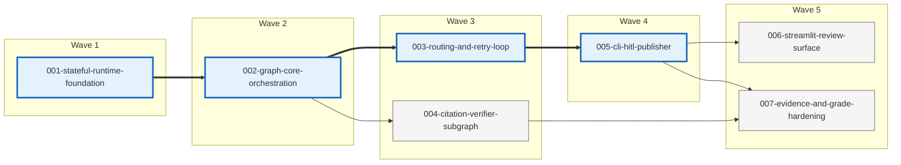

# Feature Map: langgraph-week6-labs

## 1. Summary

This project is decomposed into seven feature folders. The walking skeleton is `001-stateful-runtime-foundation -> 002-graph-core-orchestration -> 003-routing-and-retry-loop -> 005-cli-hitl-publisher`, which is the shortest linear chain that yields a CLI-run end-to-end agent with planner/tool/evaluator flow, one bounded retry, a human approval gate, and publish side effects. Wave 3 is the main parallel fan-out: `003-routing-and-retry-loop` and `004-citation-verifier-subgraph` can proceed independently once the graph core exists, while Wave 5 lets the optional Streamlit surface and the final evidence-hardening pass move in parallel. No candidate exceeded the auto-split threshold.

## 2. DAG (visual)



## 3. Features

### 001-stateful-runtime-foundation

**Folder:** `crispy-docs/projects/001-langgraph-week6-labs/features/001-stateful-runtime-foundation/`

This feature establishes the shared execution contracts that every later slice depends on: the canonical typed state, the initial-state factory, live/offline mode plumbing, the provider adapter interfaces, and the JSONL event-writer skeleton. It keeps the repo importable and reproducible before any real graph behavior is added, so later features can focus on orchestration instead of renegotiating shared primitives or environment rules.

| Field | Value |
|---|---|
| `depends_on` | `[]` |
| `walking_skeleton` | `yes` |
| `parallel_wave` | `1` |
| `complexity` | `medium` |
| `file_touches_estimate` | `9` |
| `rubric_mapping` | `Correctness of stateful design; Reproducibility` |
| `architecture_sections` | `§4, §9, §11` |

**Files this feature will create or edit** (relative to repo root `C:\repos\langgraph-sprint\`):
- `src/agent/state.py` — canonical `AgentState`, reducers, and `initial_state()` contract.
- `src/agent/logging.py` — JSONL event-writer skeleton (append mode, per-line flush, event-schema constants) consumed by every downstream feature.
- `src/tools/searcher.py` — live/offline `Searcher` abstraction for Tavily vs fake-search mode.
- `src/tools/calculator.py` — safe calculator helper and typed result model.
- `src/tools/llm.py` — `OpenAIChat` / `StubChat` adapter layer.
- `src/tools/__init__.py` — export surface for tool constructors.
- `.env.example` — documented environment knobs for model, mode, and checkpoint path.
- `pyproject.toml` — uv-managed dependency and script declarations.
- `uv.lock` — reproducible lockfile aligned with the declared dependencies.

**Acceptance criteria (testable):**
- `AgentState` and `initial_state()` match architecture §4, including `mode`, `retry_log`, `citation_verdict`, and publish/HITL fields.
- Tool adapters expose live and offline implementations without importing graph code.
- `src/agent/logging.py` exposes `write_event(thread_id, attempt, node, event, mode, **kw)` and the event-name constants from architecture §9; appends to `logs/run-<thread_id>.jsonl` and flushes per line.
- `.env.example` documents `OPENAI_MODEL`, `OFFLINE`, and `CHECKPOINT_DB`.
- `uv sync` resolves the declared runtime dependencies.

**Out of scope (deferred to later features):**
- Graph assembly and node wiring.
- Real event emission from nodes (the skeleton exists; integration happens when nodes are wired).
- Router, retry, HITL, and publish behavior.

### 002-graph-core-orchestration

**Folder:** `crispy-docs/projects/001-langgraph-week6-labs/features/002-graph-core-orchestration/`

This feature turns the shared contracts into the first runnable parent graph. It implements planner, tool, and evaluator node modules plus the graph builder/export surface, while keeping routing, retries, and HITL intentionally simple so the codebase gets a clean Lab 6.1 baseline before more branching logic is layered on.

| Field | Value |
|---|---|
| `depends_on` | `[001-stateful-runtime-foundation]` |
| `walking_skeleton` | `yes` |
| `parallel_wave` | `2` |
| `complexity` | `medium` |
| `file_touches_estimate` | `10` |
| `rubric_mapping` | `Lab 6.1; Code organization` |
| `architecture_sections` | `§3, §5` |

**Files this feature will create or edit** (relative to repo root `C:\repos\langgraph-sprint\`):
- `src/agent/__init__.py` — package exports for graph builders and public orchestration helpers.
- `src/agent/graph.py` — parent graph assembly and compile entrypoint.
- `src/agent/nodes/__init__.py` — node export surface for graph construction.
- `src/agent/nodes/planner.py` — plan generation and tool selection.
- `src/agent/nodes/search_tool.py` — structured search execution node.
- `src/agent/nodes/calculator_tool.py` — structured calculator execution node.
- `src/agent/nodes/evaluator.py` — initial publishability scoring contract.
- `src/agent/subgraphs/__init__.py` — placeholder verifier import hook used by graph core.
- `src/agent/subgraphs/citation_verifier.py` — temporary stub honoring the later verifier contract.
- `tests/test_graph_wiring.py` — compile-time graph shape assertions.

**Acceptance criteria (testable):**
- The graph compiles with at least planner, one tool node, and evaluator as executable nodes.
- Planner selects search vs calculator through structured state, not ad-hoc CLI branching.
- Search and calculator nodes emit normalized tool results that match the shared state contract.
- Wiring tests prove the graph shape and node registration are stable.

**Out of scope (deferred to later features):**
- Bounded retry, fallback, and escalation policy.
- Human interrupts, publish side effects, and Streamlit UI.

### 003-routing-and-retry-loop

**Folder:** `crispy-docs/projects/001-langgraph-week6-labs/features/003-routing-and-retry-loop/`

This feature adds the real decision points that make the graph stateful rather than linear. It introduces pure routing predicates, evaluator-owned retry decisions, fallback/escalation terminals, structured retry-log entries, and the event-emission integration on top of the foundation's logging skeleton, so the main graph can demonstrate Lab 6.2 and Lab 6.3 with one bounded loop.

| Field | Value |
|---|---|
| `depends_on` | `[002-graph-core-orchestration]` |
| `walking_skeleton` | `yes` |
| `parallel_wave` | `3` |
| `complexity` | `medium` |
| `file_touches_estimate` | `8` |
| `rubric_mapping` | `Lab 6.2; Lab 6.3; Quality of failure handling` |
| `architecture_sections` | `§6, §7, §9` |

**Files this feature will create or edit** (relative to repo root `C:\repos\langgraph-sprint\`):
- `src/agent/routers.py` — conditional-edge predicates for planner, evaluator, and HITL transitions.
- `src/agent/graph.py` — loop-back, fallback, and escalation edge wiring; emits `branch_decision` and `retry` events using the foundation's `write_event()`.
- `src/agent/nodes/planner.py` — attempt counter and retry-aware plan rewrite behavior.
- `src/agent/nodes/evaluator.py` — retry/fallback/escalate verdict logic and `retry_log` ownership; emits structured retry events including `reason` and `mitigation`.
- `src/agent/nodes/fallback.py` — safe terminal bounded-answer path.
- `src/agent/nodes/escalate_to_human.py` — terminal human-takeover interrupt path.
- `tests/test_routers.py` — branch unit tests for every conditional edge.
- `tests/test_e2e_offline.py` — deterministic offline retry-path coverage.

**Acceptance criteria (testable):**
- `route_after_evaluator` can reach planner, fallback, or `escalate_to_human` based on state.
- Retry ceiling is enforced at `max_attempts=2` with no infinite loop path.
- Each retry/fallback/escalate decision appends exactly one structured `{attempt, reason, mitigation}` entry.
- Every `retry` JSONL line emitted via `write_event()` includes `reason` and `mitigation` from the closed `Mitigation` enum.
- Offline tests prove one retry and one terminal stop path.

**Out of scope (deferred to later features):**
- Dedicated citation-verifier subgraph implementation.
- CLI/Streamlit review surfaces and publisher side effects.

### 004-citation-verifier-subgraph

**Folder:** `crispy-docs/projects/001-langgraph-week6-labs/features/004-citation-verifier-subgraph/`

This feature replaces the graph-core verifier stub with the dedicated Citation Verifier sub-agent specified in the architecture. It keeps the parent-graph contract stable while upgrading the verifier implementation to a nested workflow that extracts claims, checks alignment, and emits a grounding verdict into shared state.

| Field | Value |
|---|---|
| `depends_on` | `[002-graph-core-orchestration]` |
| `walking_skeleton` | `no` |
| `parallel_wave` | `3` |
| `complexity` | `low` |
| `file_touches_estimate` | `2` |
| `rubric_mapping` | `Lab 6.1 (additional executable node); Sub-agent integration` |
| `architecture_sections` | `§5` |

**Files this feature will create or edit** (relative to repo root `C:\repos\langgraph-sprint\`):
- `src/agent/subgraphs/__init__.py` — exports the compiled citation verifier for parent-graph wiring.
- `src/agent/subgraphs/citation_verifier.py` — nested `extract_claims -> check_alignment -> emit_verdict` workflow.

**Acceptance criteria (testable):**
- `citation_verifier` is implemented as a dedicated subgraph node, not an inline helper.
- Search-path drafts can produce `grounded` or `weak` verdicts, while calculator-path drafts yield `not_applicable`.
- The subgraph only writes the documented `citation_verdict` / `confidence` outputs into parent state.
- Retry, HITL, and publish features do not need new public contracts to consume the verifier.

**Out of scope (deferred to later features):**
- Altering the retry budget or router ownership.
- Building new UI or evidence-packaging flows.

### 005-cli-hitl-publisher

**Folder:** `crispy-docs/projects/001-langgraph-week6-labs/features/005-cli-hitl-publisher/`

This feature closes the walking skeleton by adding the canonical CLI review loop and idempotent publisher. A user can run the graph, hit a real approval interrupt, resume the same `thread_id`, and publish only after approval to the local answer and mock-email artifacts.

| Field | Value |
|---|---|
| `depends_on` | `[003-routing-and-retry-loop]` |
| `walking_skeleton` | `yes` |
| `parallel_wave` | `4` |
| `complexity` | `medium` |
| `file_touches_estimate` | `8` |
| `rubric_mapping` | `Lab 6.4; Clarity of HITL; Correctness of stateful design` |
| `architecture_sections` | `§8, §10` |

**Files this feature will create or edit** (relative to repo root `C:\repos\langgraph-sprint\`):
- `cli.py` — primary runnable CLI and approval/resume surface.
- `src/agent/graph.py` — shared `SqliteSaver` graph compilation and thread/resume helpers.
- `src/agent/nodes/hitl_gate.py` — approval interrupt payload and resume-state handling.
- `src/agent/nodes/publisher.py` — publisher-node orchestration after approval.
- `src/publisher/__init__.py` — package export surface for the publisher helper.
- `src/publisher/publisher.py` — atomic markdown and `.eml` artifact writer.
- `tests/conftest.py` — offline graph fixture with stable checkpoint path/thread setup.
- `tests/test_e2e_offline.py` — approve/reject/edit publish-path assertions.

**Acceptance criteria (testable):**
- CLI exposes approve/reject/edit choices against the same paused `thread_id`.
- No publish side effect occurs before approval.
- Approve/edit writes `outbox/answers/<thread_id>.md` and `outbox/sent/<thread_id>.eml`; reject ends cleanly.
- Re-entering publisher after a successful publish is a no-op because of the dedupe guard.

**Out of scope (deferred to later features):**
- Streamlit-based approval UX.
- Final docs/log packaging for submission.

### 006-streamlit-review-surface

**Folder:** `crispy-docs/projects/001-langgraph-week6-labs/features/006-streamlit-review-surface/`

This feature adds the secondary Streamlit surface that inspects paused runs and submits the same resume payloads as the CLI. It is intentionally isolated from the grade-critical CLI path so the project can still ship and be graded if the web UI slips.

| Field | Value |
|---|---|
| `depends_on` | `[005-cli-hitl-publisher]` |
| `walking_skeleton` | `no` |
| `parallel_wave` | `5` |
| `complexity` | `low` |
| `file_touches_estimate` | `2` |
| `rubric_mapping` | `Lab 6.4 (supplemental evidence); Clarity of HITL` |
| `architecture_sections` | `§8, §10` |

**Files this feature will create or edit** (relative to repo root `C:\repos\langgraph-sprint\`):
- `app.py` — Streamlit review surface for paused threads, approval decisions, and screenshot-friendly evidence.
- `src/agent/graph.py` — shared checkpoint access helpers reused by the web surface.

**Acceptance criteria (testable):**
- Streamlit can load paused runs from the same checkpoint DB used by the CLI.
- Approve/reject/edit actions send the same resume payload shape used by `cli.py`.
- Cross-surface resume works against the same `thread_id`.
- Streamlit adds no alternative business logic or publish rules.

**Out of scope (deferred to later features):**
- Changing node contracts or retry behavior.
- Submission evidence packaging and rubric crosswalk docs.

### 007-evidence-and-grade-hardening

**Folder:** `crispy-docs/projects/001-langgraph-week6-labs/features/007-evidence-and-grade-hardening/`

This feature produces the grader-facing evidence and hardening pass after core behavior is stable. It consolidates the commands, docs, tests, and log artifacts that prove success, retry, HITL, and sub-agent coverage without forcing the grader to reconstruct intent from source alone.

| Field | Value |
|---|---|
| `depends_on` | `[004-citation-verifier-subgraph, 005-cli-hitl-publisher]` |
| `walking_skeleton` | `no` |
| `parallel_wave` | `5` |
| `complexity` | `medium` |
| `file_touches_estimate` | `8` |
| `rubric_mapping` | `Lab 6.3 (evidence package); Evidence package completeness; Reproducibility` |
| `architecture_sections` | `§9, §12` |

**Files this feature will create or edit** (relative to repo root `C:\repos\langgraph-sprint\`):
- `README.md` — setup, live/offline run commands, and grading-friendly walkthrough.
- `docs/architecture.md` — repo-local summary linking implementation back to project architecture.
- `tests/test_graph_wiring.py` — final wiring assertions covering the real verifier node.
- `tests/test_routers.py` — branch coverage for retry/fallback/HITL routing.
- `tests/test_e2e_offline.py` — deterministic end-to-end success, retry, and HITL path.
- `logs/.gitkeep` — retained evidence directory for committed or generated JSONL traces.
- `outbox/answers/.gitkeep` — answer artifact directory retained in git.
- `outbox/sent/.gitkeep` — mock email artifact directory retained in git.

**Acceptance criteria (testable):**
- `uv run pytest` covers graph wiring, router branches, and one offline end-to-end path.
- README/docs explain live vs offline demos and where success, retry, and HITL evidence appears.
- A grader can find or generate success, retry, and HITL JSONL evidence without code archaeology.
- Final docs clearly connect artifacts back to the Week 6 rubric.

**Out of scope (deferred to later features):**
- New orchestration branches or UI surfaces.
- Refactoring already-accepted node contracts for stylistic reasons.

## 4. Walking skeleton

The smallest end-to-end working agent is the following linear chain:

1. `crispy-docs/projects/001-langgraph-week6-labs/features/001-stateful-runtime-foundation/`
2. `crispy-docs/projects/001-langgraph-week6-labs/features/002-graph-core-orchestration/`
3. `crispy-docs/projects/001-langgraph-week6-labs/features/003-routing-and-retry-loop/`
4. `crispy-docs/projects/001-langgraph-week6-labs/features/005-cli-hitl-publisher/`

`004-citation-verifier-subgraph/` is the parallel enrichment that closes the dedicated sub-agent requirement without blocking the shortest CLI-gradable path.

## 5. Parallel-wave summary

| Wave | Features | Rationale |
|---|---|---|
| 1 | `001-stateful-runtime-foundation` | Locks the shared state, mode, and provider-adapter contracts before any graph code is written. |
| 2 | `002-graph-core-orchestration` | Turns the shared contracts into the first runnable parent graph and stabilizes file ownership. |
| 3 | `003-routing-and-retry-loop`, `004-citation-verifier-subgraph` | After the graph core lands, retry routing and the nested verifier can advance independently because they touch different files and consume stable contracts. |
| 4 | `005-cli-hitl-publisher` | Caps the walking skeleton with the canonical CLI review flow and safe publish behavior. |
| 5 | `006-streamlit-review-surface`, `007-evidence-and-grade-hardening` | The Streamlit surface is intentionally non-blocking, so the optional UI and final grader-facing evidence pass can finish side-by-side. |

## 6. Rubric coverage matrix

| Rubric requirement | Satisfied by feature(s) | Architecture section |
|---|---|---|
| Lab 6.1 — 3+ executable graph nodes | `002-graph-core-orchestration`, `004-citation-verifier-subgraph` | `§3, §5` |
| Lab 6.2 — conditional routing | `003-routing-and-retry-loop` | `§6` |
| Lab 6.3 — self-correction and retry evidence | `003-routing-and-retry-loop`, `007-evidence-and-grade-hardening` | `§7, §9, §12` |
| Lab 6.4 — human-in-the-loop gate | `005-cli-hitl-publisher`, `006-streamlit-review-surface` | `§8, §10` |
| Correctness of stateful design | `001-stateful-runtime-foundation`, `005-cli-hitl-publisher` | `§4, §10` |
| Quality of failure handling | `003-routing-and-retry-loop` | `§7, §13` |
| Clarity of HITL | `005-cli-hitl-publisher`, `006-streamlit-review-surface` | `§8, §10` |
| Reproducibility | `001-stateful-runtime-foundation`, `007-evidence-and-grade-hardening` | `§11, §12` |
| Code organization | `002-graph-core-orchestration` | `§3` |
| Sub-agent integration | `004-citation-verifier-subgraph` | `§5` |

## 7. Machine-readable feature graph (YAML)

```yaml
feature_graph:
  - id: "001-stateful-runtime-foundation"
    folder: "crispy-docs/projects/001-langgraph-week6-labs/features/001-stateful-runtime-foundation"
    title: "Stateful runtime foundation"
    depends_on: []
    architecture_sections: ["§4", "§9", "§11"]
    rubric_mapping: ["Correctness of stateful design", "Reproducibility"]
    walking_skeleton: true
    parallel_wave: 1
    complexity: "medium"
    file_touches_estimate: 9
    estimated_slices: 4
  - id: "002-graph-core-orchestration"
    folder: "crispy-docs/projects/001-langgraph-week6-labs/features/002-graph-core-orchestration"
    title: "Graph core orchestration"
    depends_on: ["001-stateful-runtime-foundation"]
    architecture_sections: ["§3", "§5"]
    rubric_mapping: ["Lab 6.1", "Code organization"]
    walking_skeleton: true
    parallel_wave: 2
    complexity: "medium"
    file_touches_estimate: 10
    estimated_slices: 6
  - id: "003-routing-and-retry-loop"
    folder: "crispy-docs/projects/001-langgraph-week6-labs/features/003-routing-and-retry-loop"
    title: "Routing and retry loop"
    depends_on: ["002-graph-core-orchestration"]
    architecture_sections: ["§6", "§7", "§9"]
    rubric_mapping: ["Lab 6.2", "Lab 6.3", "Quality of failure handling"]
    walking_skeleton: true
    parallel_wave: 3
    complexity: "medium"
    file_touches_estimate: 8
    estimated_slices: 7
  - id: "004-citation-verifier-subgraph"
    folder: "crispy-docs/projects/001-langgraph-week6-labs/features/004-citation-verifier-subgraph"
    title: "Citation verifier subgraph"
    depends_on: ["002-graph-core-orchestration"]
    architecture_sections: ["§5"]
    rubric_mapping: ["Lab 6.1", "Sub-agent integration"]
    walking_skeleton: false
    parallel_wave: 3
    complexity: "low"
    file_touches_estimate: 2
    estimated_slices: 3
  - id: "005-cli-hitl-publisher"
    folder: "crispy-docs/projects/001-langgraph-week6-labs/features/005-cli-hitl-publisher"
    title: "CLI HITL publisher"
    depends_on: ["003-routing-and-retry-loop"]
    architecture_sections: ["§8", "§10"]
    rubric_mapping: ["Lab 6.4", "Clarity of HITL", "Correctness of stateful design"]
    walking_skeleton: true
    parallel_wave: 4
    complexity: "medium"
    file_touches_estimate: 8
    estimated_slices: 6
  - id: "006-streamlit-review-surface"
    folder: "crispy-docs/projects/001-langgraph-week6-labs/features/006-streamlit-review-surface"
    title: "Streamlit review surface"
    depends_on: ["005-cli-hitl-publisher"]
    architecture_sections: ["§8", "§10"]
    rubric_mapping: ["Lab 6.4", "Clarity of HITL"]
    walking_skeleton: false
    parallel_wave: 5
    complexity: "low"
    file_touches_estimate: 2
    estimated_slices: 4
  - id: "007-evidence-and-grade-hardening"
    folder: "crispy-docs/projects/001-langgraph-week6-labs/features/007-evidence-and-grade-hardening"
    title: "Evidence and grade hardening"
    depends_on: ["004-citation-verifier-subgraph", "005-cli-hitl-publisher"]
    architecture_sections: ["§9", "§12"]
    rubric_mapping: ["Lab 6.3", "Evidence package completeness", "Reproducibility"]
    walking_skeleton: false
    parallel_wave: 5
    complexity: "medium"
    file_touches_estimate: 8
    estimated_slices: 5
```

## 8. Post-M6 enhancements
Feature `008-deep-research-mode` was added after the original six-milestone submission plan completed. It intentionally does **not** rewrite the existing DAG; instead it layers deep search decomposition, `ResearchReport` state, structured publishing, and per-fact citation discipline onto the already-shipped search path and verifier/publisher contracts.
