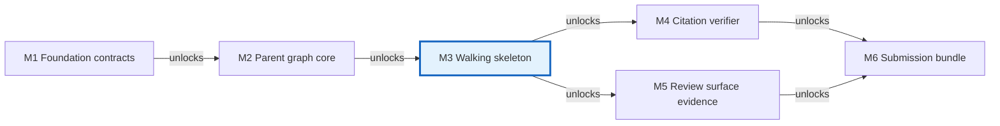

# Roadmap: langgraph-week6-labs

## 1. Summary

This roadmap uses six milestones. `M3-walking-skeleton` is the gradable end-to-end slice that closes the `001-stateful-runtime-foundation -> 002-graph-core-orchestration -> 003-routing-and-retry-loop -> 005-cli-hitl-publisher` chain and unlocks the first runnable Lab 6.1, Lab 6.2, Lab 6.3, and Lab 6.4 evidence path. `M4-citation-verifier` and `M5-review-surface-evidence` add the post-skeleton verifier and screenshot-friendly HITL surface, while `M6-submission-bundle` packages the architecture diagram, write-up, tests, logs, and artifact locations into a grader-ready bundle.

**Multi-feature milestone semantics.** A milestone may deliver more than one feature. When it does, the features inside the milestone are landed in feature-DAG order (the milestone honors `depends_on` from `feature-map.md §7` internally); the `entry_milestones` field only records cross-milestone prerequisites. Example: `M3-walking-skeleton` delivers `003-routing-and-retry-loop` first and then `005-cli-hitl-publisher` (which depends on it), even though both are listed in the same milestone's `features_delivered`.

## 2. Milestone overview (table)

| ID | Name | Features delivered | Rubric evidence unlocked | Demo command(s) | Entry criteria | Exit criteria |
|---|---|---|---|---|---|---|
| `M1-foundation-contracts` | Foundation contracts | `[001-stateful-runtime-foundation]` | Stateful design baseline; reproducibility baseline | `uv run python -c "from agent.state import initial_state; import json; print(json.dumps(initial_state('demo question', 't-demo', 'offline'), default=str, indent=2))"` | `[]` | Shared state, adapters, logging skeleton, and env contract validated |
| `M2-parent-graph-core` | Parent graph core | `[002-graph-core-orchestration]` | Initial 3+ node baseline; code-organization evidence | `uv run pytest -k graph_wiring` | `[M1-foundation-contracts]` | Graph compiles with planner/tool/evaluator core and wiring tests pass |
| `M3-walking-skeleton` | Walking skeleton | `[003-routing-and-retry-loop, 005-cli-hitl-publisher]` (delivered in DAG order: 003 → 005) | Conditional routing, retry log, HITL interrupt, publish gate, state graph end-to-end | `uv run python cli.py --offline "Demo a retry, approval, and publish path"` | `[M2-parent-graph-core]` | Offline CLI run shows retry -> HITL -> publish with no pre-approval side effects |
| `M4-citation-verifier` | Citation verifier | `[004-citation-verifier-subgraph]` | Dedicated sub-agent evidence; grounded/weak/not_applicable verifier outputs | `uv run python cli.py --offline "Summarize two sourced facts about LangGraph"` | `[M3-walking-skeleton]` | Real verifier subgraph replaces stub without changing parent-graph contract |
| `M5-review-surface-evidence` | Review surface evidence | `[006-streamlit-review-surface]` | Screenshot-friendly HITL checkpoint evidence; cross-surface approval clarity | `uv run streamlit run app.py` | `[M3-walking-skeleton]` | Streamlit can inspect and resume the same paused `thread_id` as the CLI |
| `M6-submission-bundle` | Submission bundle | `[007-evidence-and-grade-hardening]` | Architecture diagram, architecture write-up, final logs/tests/docs package | `uv run pytest` | `[M3-walking-skeleton, M4-citation-verifier, M5-review-surface-evidence]` | Grader can locate or regenerate all required artifacts from README, docs, logs, and outbox |

## 3. Milestones

### M1-foundation-contracts

**Identity**
| Field | Value |
|---|---|
| `id` | `M1-foundation-contracts` |
| `walking_skeleton_milestone` | `no` |
| `features_delivered` | `[001-stateful-runtime-foundation]` |
| `entry_milestones` | `[]` |
| `architecture_sections` | `§4, §9, §11` |

**Purpose.** This milestone locks the state, mode, logging, and provider contracts before any graph wiring begins. It reduces rework by making live/offline behavior, checkpoint configuration, and JSONL evidence shape stable across every later milestone.

**Entry criteria (must be true before starting):**
- `vision.md §5`, `vision.md §6`, `vision.md §12`, and `feature-map.md` feature `001-stateful-runtime-foundation` are accepted as the source of truth.
- The repo scaffold can be initialized with `uv` and Python 3.11+.

**Exit criteria (testable assertions when complete):**
- `uv sync` resolves the declared dependencies and produces a reproducible local environment.
- `AgentState` and `initial_state()` expose `mode`, `retry_log`, `citation_verdict`, `human_decision`, and publish/HITL fields required by the architecture.
- Tool adapters and the JSONL logging skeleton compile without importing graph assembly code.
- Demo command runs end-to-end and prints a valid initial state JSON, proving the state schema and offline mode are importable.

**Rubric evidence unlocked by this milestone:**
- Correctness of stateful design baseline
- Reproducibility baseline (`uv`, `.env.example`, offline/live toggle)

**Demo command(s):**
```bash
uv run python -c "from agent.state import initial_state; import json; print(json.dumps(initial_state('demo question', 't-demo', 'offline'), default=str, indent=2))"
```

**Parallel work possible during this milestone:**
- None; Wave 1 is the single prerequisite for every later feature.

**Out of scope (deferred to later milestones):**
- Parent graph assembly
- Conditional routing and retry logic
- HITL interrupts and publish behavior

### M2-parent-graph-core

**Identity**
| Field | Value |
|---|---|
| `id` | `M2-parent-graph-core` |
| `walking_skeleton_milestone` | `no` |
| `features_delivered` | `[002-graph-core-orchestration]` |
| `entry_milestones` | `[M1-foundation-contracts]` |
| `architecture_sections` | `§3, §5, §14` |

**Purpose.** This milestone turns the shared contracts into the first runnable parent graph. It establishes node ownership and file boundaries so later routing, verifier, and HITL work can land without reshaping the repo.

**Entry criteria (must be true before starting):**
- `M1-foundation-contracts` is complete.
- Shared state, provider adapters, and JSONL event names are stable enough for downstream nodes to consume.

**Exit criteria (testable assertions when complete):**
- The graph compiles with planner, search/calculator, evaluator, and verifier-stub nodes registered.
- Planner chooses search vs calculator through structured state, not ad-hoc CLI branching.
- `uv run pytest -k graph_wiring` passes and proves stable node registration/wiring.

**Rubric evidence unlocked by this milestone:**
- Lab 6.1 baseline with 3+ executable node roles visible in code
- Code-organization evidence aligned to the repository layout

**Demo command(s):**
```bash
uv run pytest -k graph_wiring
```

**Parallel work possible during this milestone:**
- After this milestone, `003-routing-and-retry-loop` and `004-citation-verifier-subgraph` can advance in parallel because Wave 3 splits router/evaluator work from subgraph work and their main file hotspots differ.

**Out of scope (deferred to later milestones):**
- Bounded retry, fallback, and escalation policy
- Approval interrupt and publisher side effects
- Streamlit review surface and evidence packaging

### M3-walking-skeleton

**Identity**
| Field | Value |
|---|---|
| `id` | `M3-walking-skeleton` |
| `walking_skeleton_milestone` | `yes` |
| `features_delivered` | `[003-routing-and-retry-loop, 005-cli-hitl-publisher]` |
| `entry_milestones` | `[M2-parent-graph-core]` |
| `architecture_sections` | `§6, §7, §8, §9, §10, §14` |

**Purpose.** This milestone closes the critical chain from `feature-map.md §4` by layering bounded routing/retry behavior and the CLI HITL publisher on top of the graph core. It is the roadmap's walking-skeleton milestone because it is the first point where state, conditional branching, retry evidence, interrupt/resume, and publish gating all work together in one gradable flow.

**Internal feature ordering (per §1 multi-feature milestone semantics).** This milestone delivers two features in feature-DAG order:
1. `003-routing-and-retry-loop` lands first — its `depends_on` is `[002-graph-core-orchestration]`, already satisfied by `M2-parent-graph-core`.
2. `005-cli-hitl-publisher` lands second — its `depends_on` is `[003-routing-and-retry-loop]`, satisfied by step 1 within this milestone.

No external prerequisite milestone is required beyond `M2-parent-graph-core`.

**Entry criteria (must be true before starting):**
- `M2-parent-graph-core` is complete.
- Checkpoint, `thread_id`, and JSONL event contracts are stable enough to support resume and publish evidence.

**Exit criteria (testable assertions when complete):**
- `route_after_evaluator` can branch to retry, fallback, or `escalate_to_human`, and `route_after_hitl` gates publisher execution.
- `uv run python cli.py --offline "demo question"` can produce one retry, one approval interrupt, and a publish after approval against one `thread_id`.
- No publish side effect occurs before approval, and the retry ceiling remains bounded at `max_attempts=2`.

**Rubric evidence unlocked by this milestone:**
- Code implementation with conditional routing
- Execution log showing at least one retry/correction flow
- Evidence of one HITL interrupt in action (CLI transcript/log)
- State graph implementation (3+ nodes, conditional branch included)
- Self-correction loop evidence with retry/fallback behavior
- First end-to-end Lab 6.1 / Lab 6.2 / Lab 6.3 / Lab 6.4 demo path

**Demo command(s):**
```bash
uv run python cli.py --offline "Explain a simple topic and revise once before publish"
uv run pytest -k "routers or e2e_offline"
```

**Parallel work possible during this milestone:**
- `004-citation-verifier-subgraph` can advance in parallel because it only depends on the graph core and mainly touches `src/agent/subgraphs/`, while this milestone concentrates on routers, CLI resume, and publisher flow.

**Out of scope (deferred to later milestones):**
- Replacing the verifier stub with the dedicated subgraph
- Streamlit screenshot capture
- Final grader bundle/docs hardening

### M4-citation-verifier

**Identity**
| Field | Value |
|---|---|
| `id` | `M4-citation-verifier` |
| `walking_skeleton_milestone` | `no` |
| `features_delivered` | `[004-citation-verifier-subgraph]` |
| `entry_milestones` | `[M3-walking-skeleton]` |
| `architecture_sections` | `§5, §14` |

**Purpose.** This milestone replaces the temporary verifier stub with the dedicated Citation Verifier subgraph that the architecture treats as one labeled parent-graph node. It closes the explicit sub-agent integration requirement without disturbing the already-runnable walking skeleton, and it reuses the CLI that landed in M3 for its demo.

**Entry criteria (must be true before starting):**
- `M3-walking-skeleton` is complete (provides `cli.py`, the graph entry point, and the verifier-stub contract this milestone replaces).
- Search and calculator output fields are stable enough that verifier input/output contracts are well defined.

**Exit criteria (testable assertions when complete):**
- `citation_verifier` runs as a dedicated subgraph node rather than an inline helper or stub.
- Search-path drafts can emit `grounded` or `weak` verdicts, and calculator-path drafts emit `not_applicable`.
- Parent-graph consumers still read the same `citation_verdict` and `confidence` fields without any new public contract.

**Rubric evidence unlocked by this milestone:**
- Dedicated sub-agent / nested-workflow evidence
- Additional Lab 6.1 node evidence showing the verifier as a labeled graph component

**Demo command(s):**
```bash
uv run python cli.py --offline "Summarize two sourced facts about LangGraph checkpoints"
uv run pytest -k graph_wiring
```

**Parallel work possible during this milestone:**
- `M5-review-surface-evidence` can advance in parallel because both M4 and M5 share the same prerequisite (`M3-walking-skeleton`) and touch disjoint files (`src/agent/subgraphs/citation_verifier.py` vs `app.py`).
- Feature 004 code can have begun in parallel with feature 003 during the M3 timeframe because it only needs the M2 graph-core contract; the M4 milestone simply formalizes its delivery once the CLI exists for demo.

**Out of scope (deferred to later milestones):**
- New retry-budget rules
- Alternate approval logic
- Submission packaging

### M5-review-surface-evidence

**Identity**
| Field | Value |
|---|---|
| `id` | `M5-review-surface-evidence` |
| `walking_skeleton_milestone` | `no` |
| `features_delivered` | `[006-streamlit-review-surface]` |
| `entry_milestones` | `[M3-walking-skeleton]` |
| `architecture_sections` | `§8, §10, §14` |

**Purpose.** This milestone gathers the screenshot-friendly HITL evidence that a grader can inspect without changing the authoritative CLI flow. It proves the shared `SqliteSaver` and `thread_id` rules work across both approval surfaces.

**Entry criteria (must be true before starting):**
- `M3-walking-skeleton` is complete.
- Shared checkpoint file and CLI interrupt payload/resume shape are stable.

**Exit criteria (testable assertions when complete):**
- `uv run streamlit run app.py` can list paused runs from the same checkpoint DB used by the CLI.
- Approve/reject/edit actions submit the same resume payload shape used by `cli.py`.
- Cross-surface resume works for the same paused `thread_id` without adding alternative publish rules.

**Rubric evidence unlocked by this milestone:**
- HITL checkpoint evidence (screenshot or equivalent UI capture)
- Supplemental Lab 6.4 clarity evidence across CLI and Streamlit

**Demo command(s):**
```bash
uv run streamlit run app.py
```

**Parallel work possible during this milestone:**
- None on the critical path; `007-evidence-and-grade-hardening` should wait until verifier coverage and screenshot evidence are both settled.

**Out of scope (deferred to later milestones):**
- Changing graph behavior or node contracts
- Rewriting CLI approval behavior
- Final artifact bundling

### M6-submission-bundle

**Identity**
| Field | Value |
|---|---|
| `id` | `M6-submission-bundle` |
| `walking_skeleton_milestone` | `no` |
| `features_delivered` | `[007-evidence-and-grade-hardening]` |
| `entry_milestones` | `[M3-walking-skeleton, M4-citation-verifier, M5-review-surface-evidence]` |
| `architecture_sections` | `§9, §12, §14` |

**Purpose.** This milestone turns the working project into a grader-friendly submission bundle. It consolidates tests, docs, commands, logs, and artifact locations so the grader can verify architecture, routing, retry, HITL, and sub-agent behavior without source-code archaeology.

**Entry criteria (must be true before starting):**
- `M3-walking-skeleton`, `M4-citation-verifier`, and `M5-review-surface-evidence` are complete.
- Success-path, retry-path, and HITL-path evidence can already be generated.

**Exit criteria (testable assertions when complete):**
- `uv run pytest` passes across graph wiring, routers, and offline end-to-end coverage.
- README and the repo-local architecture write-up explain live/offline demos, artifact locations, and rubric mapping.
- The submission package contains or can regenerate **all eight** required assignment artifacts, each at a documented path or via a documented command:
  1. **Architecture diagram of the graph (nodes + transitions)** — `crispy-docs/projects/001-langgraph-week6-labs/architecture.md §1` (Mermaid) plus `docs/architecture.md`.
  2. **Code implementation with conditional routing** — `src/agent/routers.py` and `src/agent/graph.py`, runnable via `uv run python cli.py`.
  3. **Execution log showing at least one retry or correction flow** — `logs/run-<thread_id>.jsonl` produced by `uv run python cli.py --offline "..."`; greppable on `"event":"retry"`.
  4. **Evidence of one human-in-the-loop interrupt in action** — same JSONL log, greppable on `"event":"interrupt_emitted"` and `"event":"interrupt_resumed"`; plus CLI transcript captured by `tee` or rich logging.
  5. **Short architecture write-up (node roles and routing logic)** — `docs/architecture.md` (repo-local summary linking to the canonical project architecture).
  6. **State graph implementation (3+ nodes, conditional branch included)** — `src/agent/state.py`, `src/agent/graph.py`, `src/agent/nodes/`; ten parent-graph nodes wired with three conditional edges per architecture §1.
  7. **Self-correction loop evidence with retry/fallback behavior** — `logs/run-<thread_id>.jsonl` for a forced-retry-then-fallback offline scenario, plus `tests/test_e2e_offline.py` deterministic coverage.
  8. **Human-in-the-loop checkpoint evidence (screenshot or log)** — JSONL log (always present) plus Streamlit screenshot saved under `docs/screenshots/hitl.png` (or equivalent path), produced by `uv run streamlit run app.py`.
- The README enumerates these eight artifacts with their paths/commands so a grader can locate or regenerate every one without reading source code.

**Rubric evidence unlocked by this milestone:**
- Architecture diagram of the graph (nodes + transitions)
- Short architecture write-up
- Final reproducibility and evidence package for the course submission

**Demo command(s):**
```bash
uv run pytest
uv run python cli.py --offline "Generate the final grader demo artifacts"
```

**Parallel work possible during this milestone:**
- None; this is the convergence and bundling milestone.

**Out of scope (deferred to later milestones):**
- New orchestration branches or UI surfaces
- Post-submission polish unrelated to rubric evidence

## 4. Critical path



## 5. Parallel opportunities

Architecture `§3` keeps everything in a single repo, so the main conflict hotspots are `src/agent/graph.py`, `tests/test_e2e_offline.py`, and the shared checkpoint/logging helpers. Parallel work is safest when features stay in their assigned file areas.

| After milestone | Parallel features | Why |
|---|---|---|
| `M2-parent-graph-core` | `003-routing-and-retry-loop` (lands in M3) and `004-citation-verifier-subgraph` (lands in M4) | Wave 3 splits router/evaluator work from subgraph work; the former concentrates on `routers.py`, `evaluator.py`, and `graph.py`, while the latter mainly touches `src/agent/subgraphs/citation_verifier.py`. Feature code can be developed concurrently after M2; milestone delivery follows the order M3 then M4. |
| `M3-walking-skeleton` | `M4-citation-verifier` and `M5-review-surface-evidence` | Both M4 and M5 share `M3-walking-skeleton` as their only prerequisite and touch disjoint files (`src/agent/subgraphs/citation_verifier.py` vs `app.py`), so verifier work and Streamlit UI work can progress side-by-side without redefining the publish gate. |

| Repo | Features touching it | Coordination note |
|---|---|---|
| `langgraph-week6-labs` | `001-stateful-runtime-foundation`, `002-graph-core-orchestration`, `003-routing-and-retry-loop`, `004-citation-verifier-subgraph`, `005-cli-hitl-publisher`, `006-streamlit-review-surface`, `007-evidence-and-grade-hardening` | Single-repo delivery keeps handoff simple, but edits that converge on `src/agent/graph.py`, `tests/test_e2e_offline.py`, README/docs, and checkpoint/logging helpers should be serialized before M6. |

## 6. Submission-ready exit criteria

- [ ] Architecture diagram of the graph (nodes + transitions) — done at `M6-submission-bundle`.
- [ ] Code implementation with conditional routing — done at `M3-walking-skeleton`.
- [ ] Execution log showing at least one retry/correction flow — done at `M3-walking-skeleton`.
- [ ] Evidence of one HITL interrupt in action — done at `M3-walking-skeleton` (CLI transcript/log) and reinforced at `M5-review-surface-evidence`.
- [ ] Short architecture write-up — done at `M6-submission-bundle`.
- [ ] State graph implementation (3+ nodes, conditional branch included) — done at `M3-walking-skeleton`.
- [ ] Self-correction loop evidence with retry/fallback behavior — done at `M3-walking-skeleton`.
- [ ] HITL checkpoint evidence (screenshot or log) — log done at `M3-walking-skeleton`; screenshot-ready capture done at `M5-review-surface-evidence`.

## 7. Risks per milestone

| Milestone | Top risk | Mitigation |
|---|---|---|
| `M1-foundation-contracts` | Live-provider assumptions undermine reproducibility. | Keep `OPENAI_MODEL` overridable and ship `FakeSearcher` / `StubChat` offline mode from the start. |
| `M2-parent-graph-core` | Sync/async mismatch complicates execution and debugging. | Keep the MVP synchronous end-to-end and prove graph shape early with targeted wiring tests. |
| `M3-walking-skeleton` | HITL restart or retry logic causes duplicate or runaway behavior. | Hard-cap attempts at `max_attempts=2`, keep side effects after `interrupt()`, and guard publisher on `published_path`. |
| `M4-citation-verifier` | Live search or verifier weakness creates misleading grounding confidence. | Degrade to `weak` / `not_applicable` when evidence is thin, and keep the offline deterministic path available for proof runs. |
| `M5-review-surface-evidence` | SQLite checkpoint lock contention or `thread_id` mismatch breaks cross-surface resume. | Use one shared file-backed `SqliteSaver`, enable WAL mode, and require the same printed `thread_id` for CLI and Streamlit resume calls. |
| `M6-submission-bundle` | Resume or packaging steps truncate the evidence trail. | Append JSONL logs with flush-per-line and validate the final bundle with `uv run pytest` plus documented artifact locations. |

## 8. Machine-readable roadmap (YAML)

```yaml
roadmap:
  - id: "M1-foundation-contracts"
    name: "Foundation contracts"
    features: ["001-stateful-runtime-foundation"]
    entry_milestones: []
    exit_criteria:
      - "uv sync resolves dependencies and yields a reproducible environment."
      - "AgentState and initial_state() expose mode, retry_log, citation_verdict, human_decision, and publish fields."
      - "Tool adapters and JSONL logging skeleton compile without graph-assembly imports."
    rubric_artifacts_unlocked:
      - "Stateful design baseline"
      - "Reproducibility baseline"
    walking_skeleton: false
    demo_commands:
      - "uv run python -c \"from agent.state import initial_state; import json; print(json.dumps(initial_state('demo question', 't-demo', 'offline'), default=str, indent=2))\""
  - id: "M2-parent-graph-core"
    name: "Parent graph core"
    features: ["002-graph-core-orchestration"]
    entry_milestones: ["M1-foundation-contracts"]
    exit_criteria:
      - "The parent graph compiles with planner, search/calculator, evaluator, and verifier-stub nodes."
      - "Planner selects search vs calculator through structured state."
      - "uv run pytest -k graph_wiring passes."
    rubric_artifacts_unlocked:
      - "Initial 3+ node baseline"
      - "Code-organization evidence"
    walking_skeleton: false
    demo_commands:
      - "uv run pytest -k graph_wiring"
  - id: "M3-walking-skeleton"
    name: "Walking skeleton"
    features: ["003-routing-and-retry-loop", "005-cli-hitl-publisher"]
    entry_milestones: ["M2-parent-graph-core"]
    exit_criteria:
      - "route_after_evaluator reaches retry, fallback, or escalate_to_human, and route_after_hitl gates publisher execution."
      - "uv run python cli.py --offline \"demo question\" shows retry -> approval interrupt -> publish for one thread_id."
      - "No publish side effect occurs before approval and retry remains bounded at max_attempts=2."
    rubric_artifacts_unlocked:
      - "Code implementation with conditional routing"
      - "Execution log showing at least one retry/correction flow"
      - "Evidence of one HITL interrupt in action"
      - "State graph implementation (3+ nodes, conditional branch included)"
      - "Self-correction loop evidence with retry/fallback behavior"
    walking_skeleton: true
    demo_commands:
      - "uv run python cli.py --offline \"Explain a simple topic and revise once before publish\""
      - "uv run pytest -k \"routers or e2e_offline\""
  - id: "M4-citation-verifier"
    name: "Citation verifier"
    features: ["004-citation-verifier-subgraph"]
    entry_milestones: ["M3-walking-skeleton"]
    exit_criteria:
      - "citation_verifier runs as a dedicated subgraph node instead of a stub."
      - "Search-path drafts emit grounded or weak verdicts; calculator-path drafts emit not_applicable."
      - "Parent-graph consumers keep using the same citation_verdict and confidence fields."
    rubric_artifacts_unlocked:
      - "Dedicated sub-agent evidence"
      - "Additional labeled-node evidence for Lab 6.1"
    walking_skeleton: false
    demo_commands:
      - "uv run python cli.py --offline \"Summarize two sourced facts about LangGraph checkpoints\""
      - "uv run pytest -k graph_wiring"
  - id: "M5-review-surface-evidence"
    name: "Review surface evidence"
    features: ["006-streamlit-review-surface"]
    entry_milestones: ["M3-walking-skeleton"]
    exit_criteria:
      - "uv run streamlit run app.py lists paused runs from the same checkpoint DB used by the CLI."
      - "Approve/reject/edit actions submit the same resume payload shape used by cli.py."
      - "Cross-surface resume works for the same paused thread_id without alternate publish rules."
    rubric_artifacts_unlocked:
      - "HITL checkpoint evidence (screenshot or log)"
      - "Supplemental Lab 6.4 clarity evidence"
    walking_skeleton: false
    demo_commands:
      - "uv run streamlit run app.py"
  - id: "M6-submission-bundle"
    name: "Submission bundle"
    features: ["007-evidence-and-grade-hardening"]
    entry_milestones: ["M3-walking-skeleton", "M4-citation-verifier", "M5-review-surface-evidence"]
    exit_criteria:
      - "uv run pytest passes across graph wiring, routers, and offline end-to-end coverage."
      - "README and the repo-local architecture write-up explain demos, artifact locations, and rubric mapping."
      - "The submission package contains or can regenerate the architecture diagram, short write-up, logs, HITL evidence, and outbox artifacts."
    rubric_artifacts_unlocked:
      - "Architecture diagram of the graph (nodes + transitions)"
      - "Short architecture write-up"
      - "Final reproducibility and evidence package"
    walking_skeleton: false
    demo_commands:
      - "uv run pytest"
      - "uv run python cli.py --offline \"Generate the final grader demo artifacts\""
```
