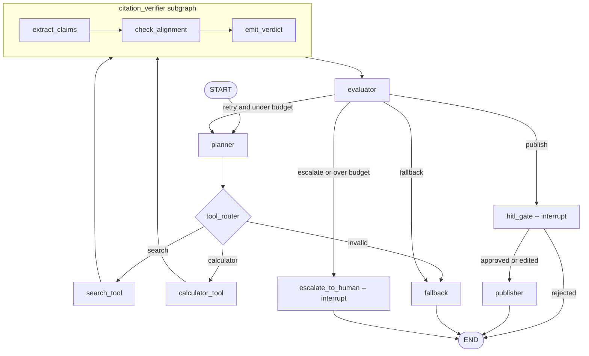

# Repository Architecture Summary

This repo packages a single LangGraph parent graph with nine parent-level nodes: `planner` chooses a tool path, `search_tool` or `calculator_tool` drafts the answer, `citation_verifier` runs a nested three-step verifier subgraph, `evaluator` decides publish vs retry/fallback/escalation, and `hitl_gate` pauses before `publisher` performs any side effects. The same SQLite checkpointer powers the CLI and Streamlit review surfaces, while JSONL logs and outbox artifacts provide grader-friendly evidence for routing, retries, interrupts, and publishing.

## Node roles

| Parent node | Purpose | Architecture link |
|---|---|---|
| `planner` | Increment the attempt counter, produce a short plan, and choose `search` vs `calculator`. | [§5 planner](../crispy-docs/projects/001-langgraph-week6-labs/architecture.md#planner) |
| `search_tool` | Run the search adapter, normalize sources, and draft a sourced answer or structured research report. | [§5 search_tool](../crispy-docs/projects/001-langgraph-week6-labs/architecture.md#search_tool) |
| `calculator_tool` | Safely evaluate arithmetic and draft a deterministic answer without citations. | [§5 calculator_tool](../crispy-docs/projects/001-langgraph-week6-labs/architecture.md#calculator_tool) |
| `citation_verifier` | Execute the nested verifier subgraph (`extract_claims -> check_alignment -> emit_verdict`) and write `citation_verdict`. | [§5 citation_verifier](../crispy-docs/projects/001-langgraph-week6-labs/architecture.md#citation_verifier) |
| `evaluator` | Score the current draft and choose publish, retry, fallback, or escalation while owning `retry_log`. | [§5 evaluator](../crispy-docs/projects/001-langgraph-week6-labs/architecture.md#evaluator) |
| `hitl_gate` | Emit the approval interrupt after evaluator success and before any publish side effects. | [§5 hitl_gate](../crispy-docs/projects/001-langgraph-week6-labs/architecture.md#hitl_gate) |
| `publisher` | Write the approved markdown answer and mock email envelope exactly once per `thread_id`. | [§5 publisher](../crispy-docs/projects/001-langgraph-week6-labs/architecture.md#publisher) |
| `fallback` | End with a bounded safe response when the graph should stop without manual takeover. | [§5 fallback](../crispy-docs/projects/001-langgraph-week6-labs/architecture.md#fallback) |
| `escalate_to_human` | Emit the escalation interrupt when retry budget is exhausted and auto-publish is unsafe. | [§5 escalate_to_human](../crispy-docs/projects/001-langgraph-week6-labs/architecture.md#escalate_to_human) |

## Deep research mode
When `planner` keeps the run on the search path, it now also decides `research_depth`. `shallow` preserves the legacy single-query answer flow, while `deep` expands into 3–5 sub-queries, `search_tool` dedupes the combined results into a structured `ResearchReport`, `citation_verifier` checks each fact against its cited snippets, and `publisher` emits sectioned markdown (`Direct Answer`, `Key Facts`, `Sources`, and source-diversity notes).

## Routing rules

| Conditional edge | Predicate | Destinations | Architecture link |
|---|---|---|---|
| `planner -> route_planner_output` | Read `selected_tool`; `search` goes to `search_tool`, `calculator` goes to `calculator_tool`, anything else goes to `fallback`. | `search_tool`, `calculator_tool`, `fallback` | [§6 routing](../crispy-docs/projects/001-langgraph-week6-labs/architecture.md#6-routing-and-conditional-edges) |
| `evaluator -> route_after_evaluator` | Publishable + safe goes to `hitl_gate`; retryable + budget left loops to `planner`; exhausted + unsafe goes to `escalate_to_human`; everything else goes to `fallback`. | `hitl_gate`, `planner`, `fallback`, `escalate_to_human` | [§6 routing](../crispy-docs/projects/001-langgraph-week6-labs/architecture.md#6-routing-and-conditional-edges) |
| `hitl_gate -> route_after_hitl` | `approved` or `edited` continues to `publisher`; `rejected` ends immediately. | `publisher`, `END` | [§6 routing](../crispy-docs/projects/001-langgraph-week6-labs/architecture.md#6-routing-and-conditional-edges) |

## Self-correction summary
- **Budget:** `max_attempts=2` total attempts (initial pass plus at most one retry).
- **Retry:** `evaluator` chooses `retry` when evidence is weak, a retryable tool problem occurred, or confidence is too low and another attempt is still allowed.
- **Fallback:** `evaluator` routes to `fallback` when the graph can still return a safe bounded answer without pretending certainty.
- **Escalate:** `evaluator` routes to `escalate_to_human` when retries are exhausted and `unsafe_to_publish` is still true.
- **Mitigation enum:** `revised_query`, `switched_tool`, `added_context`, `escalated_to_human`, `fell_back`, `none`.

## HITL summary
The project uses dynamic `interrupt()` calls, not static breakpoints. `hitl_gate` emits `kind: "approval"` with `{draft_answer, sources, verifier_verdict, attempt, mode}`, while `escalate_to_human` emits `kind: "escalation"` with the same run context plus `retry_log`. Resume payloads use `{decision, edited_text?}` where approval accepts `approved | rejected | edited` and escalation accepts `acknowledged | edited`.

The idempotency rule is strict: no side effects occur before the interrupt, and `publisher` immediately returns `{}` when `published_path` is already set, preventing duplicate writes on replay or resume. `cli.py` is the canonical review surface, and `app.py` exposes the same paused payload and resume actions against the same `CHECKPOINT_DB` so CLI and Streamlit evidence stay in sync.

See the full architecture at `crispy-docs/projects/001-langgraph-week6-labs/architecture.md` (16 sections).
